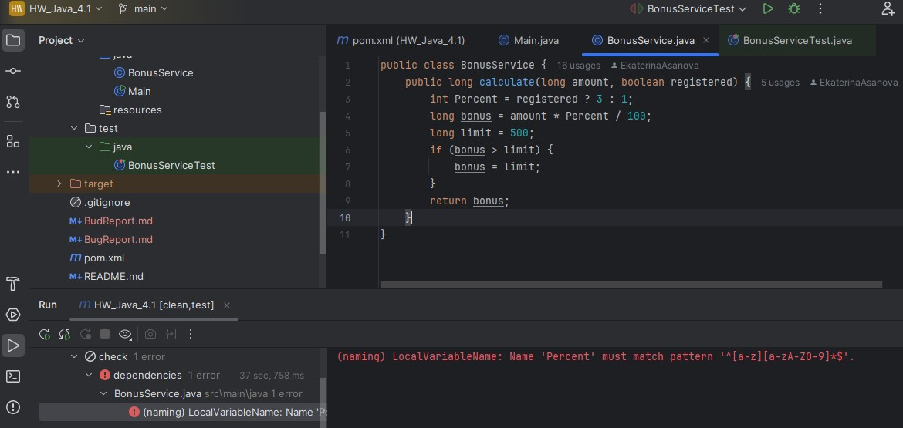
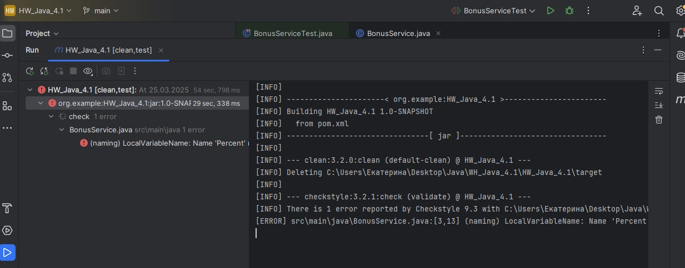

# Название
Заглавная буква в названии переменной Percent в классе BonusService

## Описание
Название переменной Percent в классе BonusService начинается с заглавной буквы

## Локация дефекта


## Шаги воспроизведения

1. Открыть код программы в IDEA

2. Запустить mvn clean test

# Логи сборки

<details>
<summary>mvn clean test </summary>

``` text 

C:\Users\Екатерина\.jdks\corretto-11.0.26\bin\java.exe -Dmaven.multiModuleProjectDirectory=C:\Users\Екатерина\Desktop\Java\WH_Java_4.1\HW_Java_4.1 -Djansi.passthrough=true "-Dmaven.home=C:\Program Files\JetBrains\IntelliJ IDEA 2024.3.4.1\plugins\maven\lib\maven3" "-Dclassworlds.conf=C:\Program Files\JetBrains\IntelliJ IDEA 2024.3.4.1\plugins\maven\lib\maven3\bin\m2.conf" "-Dmaven.ext.class.path=C:\Program Files\JetBrains\IntelliJ IDEA 2024.3.4.1\plugins\maven\lib\maven-event-listener.jar" "-javaagent:C:\Program Files\JetBrains\IntelliJ IDEA 2024.3.4.1\lib\idea_rt.jar=51540" -Dfile.encoding=UTF-8 -classpath "C:\Program Files\JetBrains\IntelliJ IDEA 2024.3.4.1\plugins\maven\lib\maven3\boot\plexus-classworlds-2.8.0.jar;C:\Program Files\JetBrains\IntelliJ IDEA 2024.3.4.1\plugins\maven\lib\maven3\boot\plexus-classworlds.license" org.codehaus.classworlds.Launcher -Didea.version=2024.3.4.1 clean test
[INFO] Scanning for projects...
[INFO] 
[INFO] ----------------------< org.example:HW_Java_4.1 >-----------------------
[INFO] Building HW_Java_4.1 1.0-SNAPSHOT
[INFO]   from pom.xml
[INFO] --------------------------------[ jar ]---------------------------------
[INFO] 
[INFO] --- clean:3.2.0:clean (default-clean) @ HW_Java_4.1 ---
[INFO] Deleting C:\Users\Екатерина\Desktop\Java\WH_Java_4.1\HW_Java_4.1\target
[INFO] 
[INFO] --- checkstyle:3.2.1:check (validate) @ HW_Java_4.1 ---
[INFO] There is 1 error reported by Checkstyle 9.3 with C:\Users\Екатерина\Desktop\Java\WH_Java_4.1\HW_Java_4.1\target\checkstyle-rules.xml ruleset.
[ERROR] src\main\java\BonusService.java:[3,13] (naming) LocalVariableName: Name 'Percent' must match pattern '^[a-z][a-zA-Z0-9]*$'.
[INFO] ------------------------------------------------------------------------
[INFO] BUILD FAILURE
[INFO] ------------------------------------------------------------------------
[INFO] Total time:  24.774 s
[INFO] Finished at: 2025-03-26T00:13:09+05:00
[INFO] ------------------------------------------------------------------------
[ERROR] Failed to execute goal org.apache.maven.plugins:maven-checkstyle-plugin:3.2.1:check (validate) on project HW_Java_4.1: You have 1 Checkstyle violation. -> [Help 1]
[ERROR] 
[ERROR] To see the full stack trace of the errors, re-run Maven with the -e switch.
[ERROR] Re-run Maven using the -X switch to enable full debug logging.
[ERROR] 
[ERROR] For more information about the errors and possible solutions, please read the following articles:
[ERROR] [Help 1] http://cwiki.apache.org/confluence/display/MAVEN/MojoFailureException

Process finished with exit code 1

```

</details>


**Ожидаемый результат:** успешное прохождение сборки

**Фактический результат:** ошибка при прохождение сборки из-за неправильного именования переменной Percent

**Скриншот**



**Окружение**
* Операционная система: Windows 8.1 Корпоративная
* IDE: IntelliJ IDEA 2024.3.4.1
* Java: OpenJDK11